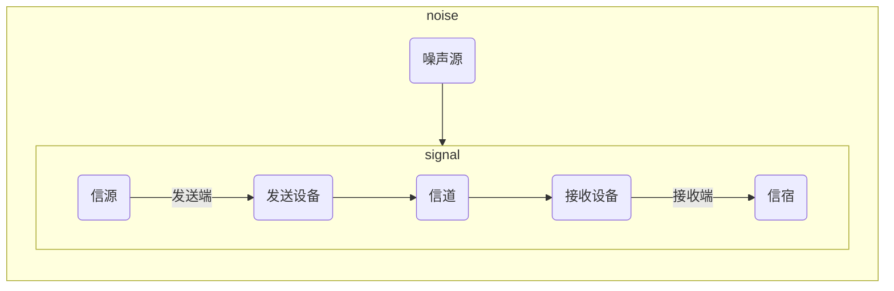
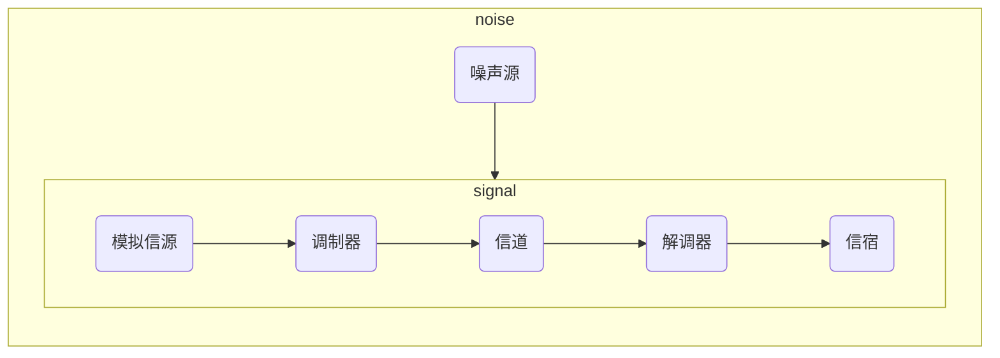

# 第一章

## 通信系统模型

- 通信系统一般模型

- 模拟通信系统模型

## 信息及其度量

- 信息量
设 $P(x)$ 表示消息发生的概率， $I$ 表示消息中所含的信息量，则有以下关系：

$$ I = log_a\frac{1}{P(x)} = -log_aP(x) $$

$ a $ 的取值不同，信息量的单位也不同，下表是取值与单位之间的关系

|  $a$  | 单位 |
| :---: | :-------: |
|   2   | b(比特) |
|  $e$  | nat(奈特) |
|  10   | Hartley(哈特莱) |

- 信息熵

$$ H(x) = -\sum_{i=1}^{M}P(x_i)log_2P(x_i)\ \ (b/符号)$$

## 数字通信系统有效性和可靠性

- 有效性
  通过传输速率和频带利用率来衡量
  > 码元传输速率 $R_B$ 为每秒传输码元的数目,单位为波特(Baud),简记为B, $R_B = \frac1T (B)$ ,其中 $T$ 为码元持续时间(秒).

  > 信息传输速率 $R_b$ 为单位时间内传递的信息量或者比特数,单位为比特/秒,简记为b/s或bps

  $$R_b=R_Blog_2M (bps) $$
  对于二进制数字信号,$M=2$因此码元速率和信息传输速率在数值上相等.

  > 频带利用率是单位带宽内的传输速率, $\eta=\frac{R_B}{B} (B/Hz)$ 或者 $\eta_b=\frac{R_b}{B} (b/s/Hz)$ 
  
- 可靠性
  常用误码率和误信率表示
  > 误码率 $P_e=\frac{错误码元数}{总码元数}$ 

  > 误信率 $P_b=\frac{错误比特数}{总比特数}$ 
  
  在二进制中有 $P_e=P_b$ 
