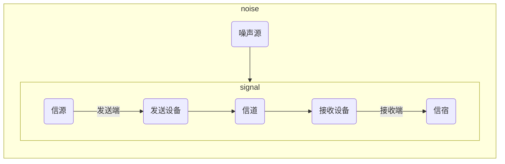
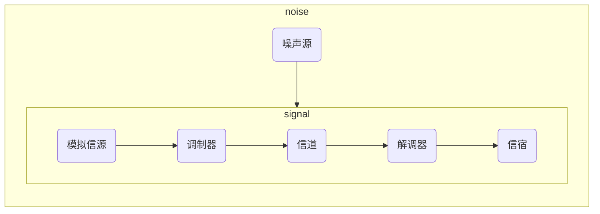

# 第一章

## 通信系统模型

- 通信系统一般模型

- 模拟通信系统模型

## 信息及其度量

- 信息量
设 $P(x)$ 表示消息发生的概率， $I$ 表示消息中所含的信息量，则有以下关系：

$$ I = log_a\frac{1}{P(x)} = -log_aP(x) $$

$ a $ 的取值不同，信息量的单位也不同，下表是取值与单位之间的关系

| $ a $ | 单位 |
| :---: | :-------: |
|   2   | b(比特) |
| $ e $ | nat(奈特) |
|  10   | Hartley(哈特莱) |

- 信息熵

$$ H(x) = -\sum_{i=1}^{M}P(x_i)log_2P(x_i)\ \ (b/符号)$$