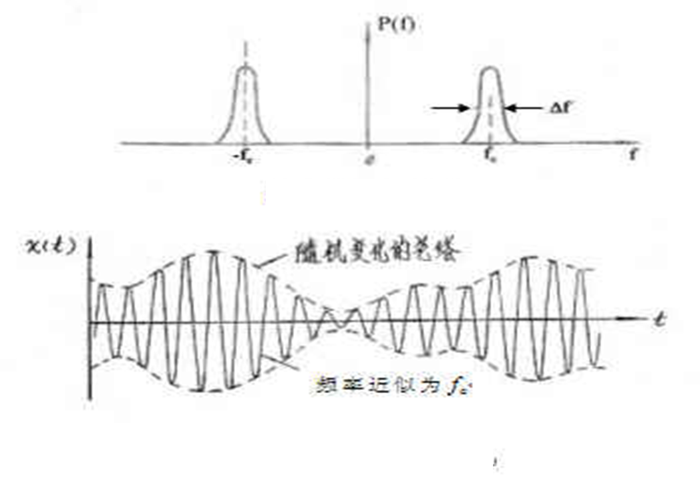

# 第三章 随机过程

## 正态分布

高斯随机变量在任意时刻上的取值是一个正态分布的随机变量，一维概率密度函数为：

$$ f(x)=\frac{1}{\sqrt{2\pi}\sigma}\exp(-\frac{(x-a)^2}{2\sigma^2}) $$

其中 $ a $ 为均值, $ \sigma^2 $ 为方差

**正态分布函数**

$$ F(x)=P(\xi\leq x) $$

可用误差函数表示

$$ F(x) = \frac12+\frac{1}{2}erf(\frac{x-a}{\sqrt2\sigma}) $$

其中

$$ erf(x) = \frac{2}{\sqrt\pi}\int^x_0e^{-t^2}dt $$

**互补误差函数**

$$ erfc(x) = 1-erf(x) $$

$$ F(x) =  1-\frac12erfc(\frac{x-a}{\sqrt{2}\sigma}) $$

当 $ x>2 $ 时

$$ erfc(x)\approx\frac{1}{x\sqrt{\pi}}e^{-x^2} $$

**Q函数**

$$ Q(x) = \frac{1}{\sqrt{2\pi}}\int^\infty_xe^{-t^2/2} $$

即正态分布概率密度函数从 $ x $到无穷的积分,因此可以得到

$$ F(x)=1-Q(\frac{x-a}{\sigma}) $$ 

## 瑞利分布

当一个随机二维向量的两个分量呈独立同方差的正态分布时,向量的模呈瑞利分布.

$$ f(x;\sigma) = \frac{x}{\sigma^2}e^{-x^2/2\sigma^2},x\geq0 $$

## 莱斯分布

$$ f(x|v,\sigma)=\frac{x}{\sigma^2}\exp(\frac{-(x^2+v^2)}{2\sigma^2})I_0(\frac{xv}{\sigma^2}) $$

其中 $ I_0(z) $ 是修正的第一类零阶贝塞尔函数,当 $ v=0 $ 时莱斯分布退化为瑞利分布.

## 随机过程

**一维分布函数**

$$ F_1(x_1,t_1) = P[\xi(t_1)\leq x_1] $$

**一维概率密度函数**

$$ f_1(x_1,t_1) = \frac{\partial F_1(x_1,t_1)}{\partial x_1} $$

**随机过程存在均值和方差**

$$ a(t)=E[\xi(t)] = \int^\infty_{-\infty} xf_1(x,t)dx $$

$$ \sigma^2(t)=D[\xi(t)] = E\{[\xi(t)-a(t)]^2\} = \int^\infty_{-\infty}x^2f_1(x,t)dx - [a(t)]^2 $$

即均方值减去均值平方

**相关函数**

$$ R(t_1,t_2)=E[\xi(t_1)\xi(t_2)] $$

$$ =\int^\infty_{-\infty}\int^\infty_{-\infty}x_1x_2f_2(x_1,x_2;t_1,t_2)dx_1dx_2 $$

平稳过程中,其自相关函数仅与 $ \tau=t_2-t_1 $ 有关,因此可以记为 $ R(\tau) $

其具有以下性质
$ \xi(t) $ 的平均功率

$$ R(0) = E[\xi^2(t)] $$

$ \xi(t) $ 的直流功率

$$ R(\infty) = E^2[\xi(t)] = a^2 $$

$ \xi(t) $ 的交流功率

$$ R(0) - R(\infty) = \sigma^2 $$

同时具有以下性质
偶函数

$$ R(\tau) = R(-\tau) $$

有界性

$$ |R(\tau)| \leq R(0) $$

**功率谱密度**

维纳辛钦关系
非周期功率型信号的自相关函数与功率谱密度为傅里叶变换关系,对平稳随机过程同样成立,即有

$$ P_\xi(\omega) = \int^\infty_{-\infty}R(\tau)e^{-j\omega\tau}d\tau $$

$$ R(\tau)=\frac{1}{2\pi}\int_{-\infty}^\infty P_\xi(\omega)e^{j\omega\tau}d\omega $$

对功率谱密度进行积分可以得到平稳过程的总功率

$$ R(0) = \int^\infty_{-\infty}P_\xi(f)df $$

**平稳随机过程通过线性系统**

$$ \xi_o(t) = \int^\infty_{-\infty}h(\tau)\xi_i(t-\tau)d\tau $$

假设 $ \xi_i(t) $ 的均值为 $ a $ , 自相关函数为 $ R_i(\tau) $ ,功率谱密度为 $ P_i(\omega) $ 则有

$$ E[\xi_o(t)] = a $$

$$ P_o(f) = |H(f)|^2P_i(f) $$

可通过 $ P_o(f) $ 的反傅里叶变换求得 $ R(\tau) $

**窄带随机过程**
随机过程的谱密度集中在中心频率 $ f_c $ 附近相对窄的频率范围 $ \Delta f $ 内

可表示为

$$ \xi(t) = a_\xi(t)\cos[\omega_ct+\varphi_\xi(t)] $$

其中 $ a_\xi(t) $ 为随机包络, $ \varphi_\xi(t) $ 为随机相位, $ \omega_c $ 为中心角频率

将表达式展开可以得到

$$ \xi(t) = \xi_c(t)\cos\omega_ct - \xi_s(t)\sin\omega_ct $$

其中 $ \xi_c(t)=a_\xi(t)\cos\varphi_\xi(t) $ 为同相分量, $ \xi_s(t)=a_\xi(t)\sin\varphi_\xi(t) $ 为正交分量,且均为平稳的,具有相同的平均功率和方差(自相关函数相同)

**正弦波加窄带高斯噪声**

$$ r(t) = A\cos(\omega_ct+\theta)+n(t) $$
其中

$$ n(t) = n_c(t)\cos\omega_ct - n_s(t)sin\omega_ct $$

平均功率

$$ N = n_0B $$